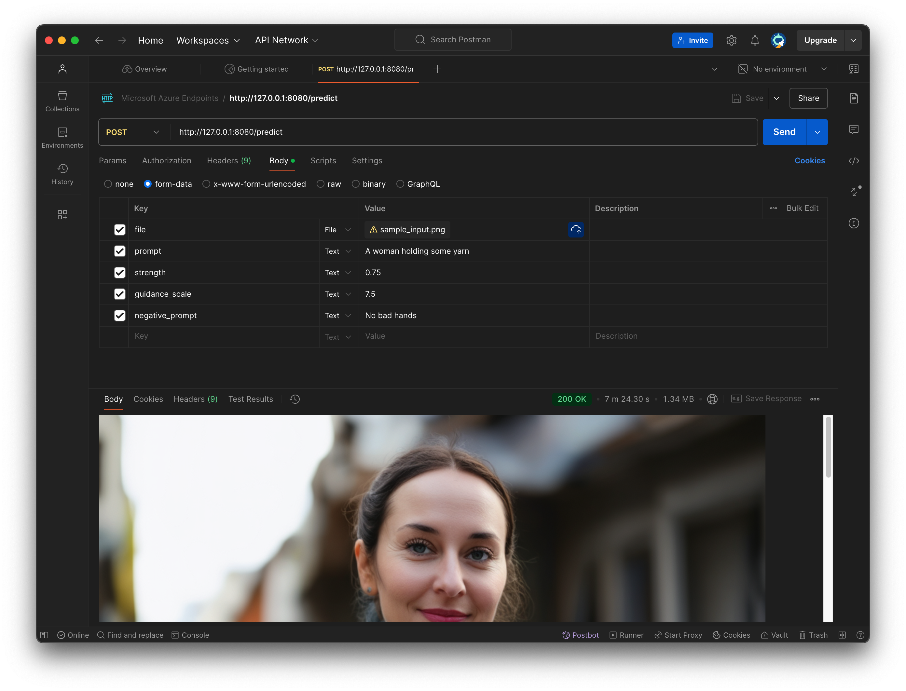

# Microsoft Azure Endpoints - Stable Diffusion 3.5 Image-to-Image
This repo folder is for building a Microsft Azure Endpoint for Stable Diffusion 3.5 Image-to-Image

**[Postman](https://www.postman.com/downloads/) Screenshot:**


# Running the [app.py](./app.py) Python Flask Application Independently
1. Open a web browser, log in to Hugging Face and register your name and email
2. git clone [stable-diffusion-3.5-medium](https://huggingface.co/stabilityai/stable-diffusion-3.5-medium) to your local machine
   ```
   git clone https://huggingface.co/stabilityai/stable-diffusion-3.5-medium
   ```
3. Clone this repo ([azure-examples](../../../../../)) to your local machine and change into the directory for this demo:
   ```
   cd ./sdk/python/foundation-models/stable-diffusion-3.5/sd35-image-to-image
   ```
4. Create a Python 3.10 virtual environment:
   ```
   python3.10 -m venv <your_environment_name>
   source <your_environment_name>/bin/activate
   ```
5. Inside your virutal environment, set the `MODEL_PATH` environment variable equal to the absolute path of your Stable Diffusion model downloaded in step 2 above, for example:
   ```
   export MODEL_PATH=/absolute/path/to/stable-diffusion-3.5-medium
   ```
6. Install dependencies
   ```
   pip install -r requirements.txt
   ```

   NOTE: Read [requirements.txt](./requirements.txt) for
   [MacOS PyTorch installation instructions](https://developer.apple.com/metal/pytorch/)

   TL;DR:
   ```
   # Inside your virtual environment
   pip install --pre torch torchvision torchaudio --extra-index-url https://download.pytorch.org/whl/nightly/cpu
   ```
7. Start the Flask app
   ```
   python app.py
   ```
8. Make POST requests in [Postman](https://www.postman.com/downloads/) (or [curl](./sample-curl-request.sh), or a REST API client of your choice); for example:
   ```
   # Postman POST request URL
   http://127.0.0.1:8080/predict
   ```
   ```
   # Postman POST request Body, form-data radio button, key-value Text
   prompt:A woman holding some yarn
   strength:0.75
   guidance_scale:7.5
   negative_prompt:No bad hands
   ```
   ```
   # Postman POST request Body, form-data radio button, key-value File
   file:<image uploaded through Postman UI>
   ```
9. The generated image is viewable directly in postman as a PNG. It is also saved in the [./images](./images/) folder

# Creating and Testing an Azure Endpoint Locally
Please see the following documentation:
* [Deploy and score a machine learning model by using an online endpoint](https://learn.microsoft.com/en-us/azure/machine-learning/how-to-deploy-online-endpoints).
* Also conveniently available as a Python notebook: [online-endpoints-simple-deployment.ipynb](https://github.com/Azure/azureml-examples/blob/main/sdk/python/endpoints/online/managed/online-endpoints-simple-deployment.ipynb).

**NOTE:** The "Python SDK" instructions were followed when `waheed.brown@stability.ai` initially started this work for Microsoft. However, the above [documentation](https://learn.microsoft.com/en-us/azure/machine-learning/how-to-deploy-online-endpoints) contains "Azure CLI", Azure AI Studio ("Studio") and "ARM template" deployment options as well.

## [score.py](./score.py) Modifications
The original [scikit-learn score.py](https://github.com/Azure/azureml-examples/blob/main/sdk/python/endpoints/online/model-1/onlinescoring/score.py) file from the [azureml-examples](https://github.com/Azure/azureml-examples/tree/main) repo was used as a template.

Here are some important details for using the Stable Diffusion [score.py](./score.py) file contained here:
* The Stable Diffusion 3.5 models cannot be saved and used as a Pickle (.pkl) file, like the [scikit-learn model](https://github.com/Azure/azureml-examples/blob/main/sdk/python/endpoints/online/model-1/onlinescoring/score.py#L17) is.
  * Instead, the Stable Diffusion 3.5 model must be downloaded from Hugging Face and referenced as a directory containing all of the model weights, tokenizer and configuration (json) files.
*  For Stable Diffusion 3.5 image-to-image the `POST` request data is **NOT** `Content-Type: application/json`.
   * Instead the `POST` request data it is `Content-Type: multipart/form-data`, with `request.form` and `request.file` objects

## Sample curl Request
In practice you would use [Postman](https://www.postman.com/downloads/), curl or a REST API client of your choice) to make a `POST` request with `Content-Type: multipart/form-data`. Here is a curl example:
  ```
  curl \
    -X POST \
    -F "file_field=@path/to/sample_input.png" \
    -F "prompt=A woman holding some yarn" \
    -F "strength=0.75" \
    -F "guidance_scale=7.5" \
    -F "negative_prompt=No bad hands" \
    http://127.0.0.1:8080/predict
  ```